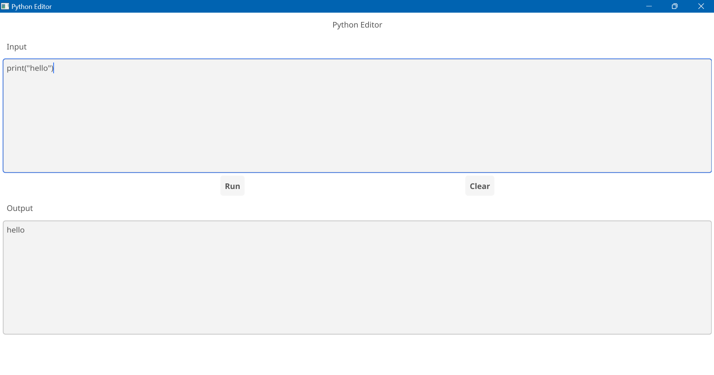

# Simple Python Code Editor and Executor GUI Desktop Application built using Go Language

A simple Python code editor and executor graphical user interface (GUI) desktop application built uisng Go programming language.

This is built using Go packages like Fyne, os, io, log and others.

This requires Go and Python already installed in the local machine.

#### The GUI has the following elements - 

    The Input field for the Python code.
    The Run button run the Python code from the Input field.
    The Clear button clear the Input and Output fields.
    The Output field shows the output of the Python code.

#### Go 1.22.5 Installation

To download Go software from the below link and follow the standard application installation procedure.

    https://go.dev/doc/install

To validate Go is installed using below commands

    go version

#### Python 3.10 Installation

To download python software from the below link and follow the standard application installation procedure.

    https://www.python.org/downloads/release/python-3103/

Environment variables to be configured for python.
    
    Open Start -> Settings -> Control Panel -> System -> Advanced -> Environment Variables
        C:\Python_3.10.3\
        C:\Python_3.10.3\Scripts\

To validate python is installed using below commands

    python --version

#### Fyne Package Installation 

    https://docs.fyne.io/started/

Since Go 1.16 you will need to set up the module before you can use the package.

Run the following command and replace MODULE_NAME with your preferred module name (this should be called in a new folder specific for your application).

    mkdir myapp
    cd myapp
    go mod init MODULE_NAME

You now need to download the Fyne module and helper tool. This will be done using the following commands:

    go get fyne.io/fyne/v2@latest
    go install fyne.io/fyne/v2/cmd/fyne@latest

If you want to see the Fyne toolkit in action before you start to code your own application, you can see our demo app running on your computer by executing:

    go run fyne.io/fyne/v2/cmd/fyne_demo@latest

#### Running the application using project module

    go run python_editor

#### Building the executable using project module

    go build python_editor

#### Running the application using executable file

    python_editor.exe

#### Application Screen 

